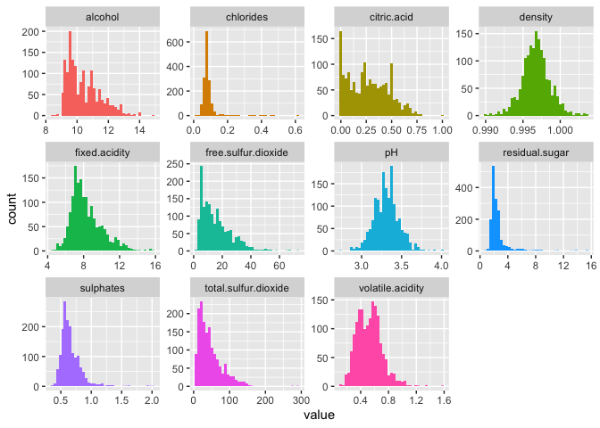
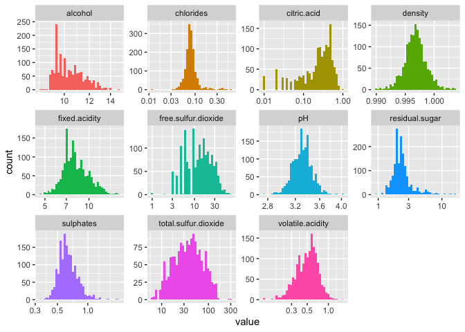
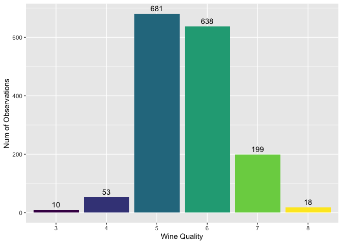
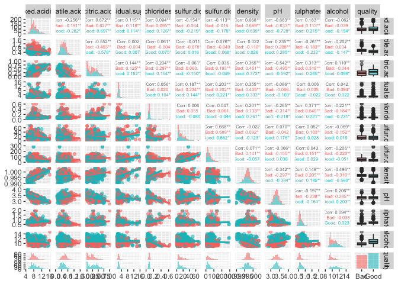
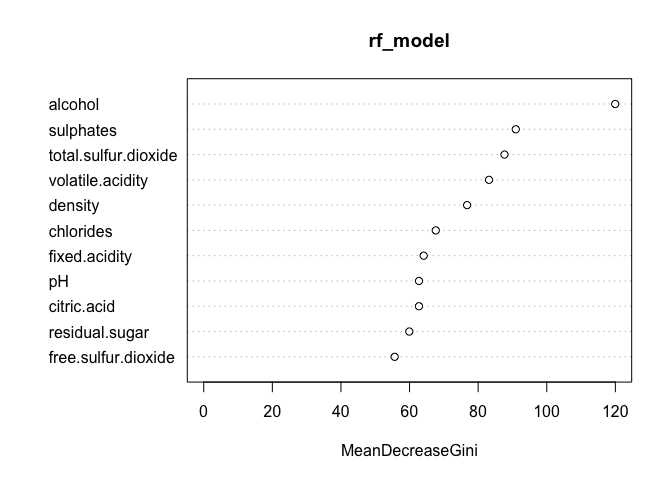

qualityprodiction
================
Arthur Chen
2022-12-15

1.  Load Needed Libaries

``` r
library(ggplot2) # Plotting 
library(GGally) # ggpairs plot
```

    ## Registered S3 method overwritten by 'GGally':
    ##   method from   
    ##   +.gg   ggplot2

``` r
library(caret) # Showing Confusion Matrix Data (among many other useful functions)
```

    ## Loading required package: lattice

``` r
library(purrr) # Organizing
```

    ## 
    ## Attaching package: 'purrr'

    ## The following object is masked from 'package:caret':
    ## 
    ##     lift

``` r
library(tidyr) # Organize/tidy data
library(reshape) # Melt data for plotting
```

    ## 
    ## Attaching package: 'reshape'

    ## The following objects are masked from 'package:tidyr':
    ## 
    ##     expand, smiths

``` r
library(knitr) #kable(head(wineDf)) 
```

2.  Exploratory Data Analysis: Exploratory data analysis will be
    performed in this part to see how the data variables look like and
    how quality relates to the other variables individually.

``` r
## Read in the Data
wineDf = read.csv("winequality-red.csv", header=T) # Load the data
wineDf.orig = wineDf # Save off original copy before making any alterations
## Change quality to categorical
wineDf$quality = as.ordered(wineDf$quality) # Change quality to (ordered) factor
## Split wine quality into good wine or bad wine for later
wineDfBinaryQuality = wineDf.orig
wineDfBinaryQuality$quality = as.factor(ifelse(wineDf.orig$quality>5.5,"Good","Bad"))
## Visual Look at the Numeric/Continuous Variables in Data Set
wineDf %>%
  keep(is.numeric) %>% 
  gather() %>% 
  ggplot(aes(value,fill=key)) +
  facet_wrap(~ key, scales = "free") +
  geom_histogram(bins=sqrt(nrow(wineDf))) +
  theme(legend.position="none") 
```

<!-- -->

``` r
### Log transformation
wineDf %>%
  keep(is.numeric) %>% 
  gather() %>% 
  ggplot(aes(value,fill=key)) +
  facet_wrap(~ key, scales = "free") +
  geom_histogram(bins=sqrt(nrow(wineDf))) +
  theme(legend.position="none") +
  scale_x_continuous(trans='log10')
```

    ## Warning: Transformation introduced infinite values in continuous x-axis

    ## Warning: Removed 132 rows containing non-finite values (stat_bin).

<!-- -->

Interpretation: The first figure shows that density and pH appear to be
symmetric, with no heavy tails. This indicates that the distribution
appears to be normal distribution. Volatile acidity has a reasonably
typical distribution as well. Looking at the remaining variables, one
can observe that a number of distributions, such as chlorides, fixed
acidity, residual sugar, and sulphates, are skewed (having a right
tail). This suggests that the majority of the wines in these
distributions have lower end values, with a few exceptions having
somewhat higher end values. Looking at residual sugar, for example, the
majority of the numbers lie between 0 and 4 grams of residual sugar per
decimeter cubed of wine; nevertheless, there are a few values that are
higher than 4 and even some that are lower. Here, log transformation is
applied to improve the skewed distribution. By setting the x axis to a
log scale, we can demonstrate this impact. Below are the identical
graphs, but with the x axis displayed on a log scale. We then observe in
the second Figure that the previously skewed distributions appear more
visually normal. This illustrates the results of applying a log
transformation to a (right tail) skewed distribution. Now that the
numerical/continuous data has been examined, let’s use a bar plot to
examine quality, the only variable in the data that resembles a
categorical one.

``` r
## Visualization of Wine Quality
ggplot(wineDf, aes(x=quality, fill = quality)) +
  geom_bar(stat="count") +
  geom_text(position = "stack", stat='count',aes(label=..count..), vjust = -0.5)+
  labs(y="Num of Observations", x="Wine Quality") +
  theme(legend.position="none")
```

<!-- -->

Interpretation: The figure illustrates how quality is not evenly
distributed from 0 to 10. The majority of numbers fall between 5 and 6.
In other words, there are significantly more average wines than
extremely good or subpar wines. Because of this, it could be more
challenging to define what makes a good or bad wine. To help with this,
one may simply divide the wines into two categories: good wine quality
and low wine quality. It would be logical to divide the wines into bad
and good wines by 5 or below and 6 or above if one wants to create a
binary wine quality variable that is consistent across all wines because
5 and 6 have a pretty even number of wines and have the majority of the
wines overall.

``` r
## Visual Look at the Data Set with Pairs Plot Colored by Good/Bad Wine Quality
ggpairs(wineDfBinaryQuality, 
        aes(alpha=0.6, color = quality),
        upper = list(continuous = wrap("cor", size = 2)),
        diag = list(continuous = "barDiag"),
        lower = list(continuous = "smooth"))
```

    ## `stat_bin()` using `bins = 30`. Pick better value with `binwidth`.
    ## `stat_bin()` using `bins = 30`. Pick better value with `binwidth`.
    ## `stat_bin()` using `bins = 30`. Pick better value with `binwidth`.
    ## `stat_bin()` using `bins = 30`. Pick better value with `binwidth`.
    ## `stat_bin()` using `bins = 30`. Pick better value with `binwidth`.
    ## `stat_bin()` using `bins = 30`. Pick better value with `binwidth`.
    ## `stat_bin()` using `bins = 30`. Pick better value with `binwidth`.
    ## `stat_bin()` using `bins = 30`. Pick better value with `binwidth`.
    ## `stat_bin()` using `bins = 30`. Pick better value with `binwidth`.
    ## `stat_bin()` using `bins = 30`. Pick better value with `binwidth`.
    ## `stat_bin()` using `bins = 30`. Pick better value with `binwidth`.
    ## `stat_bin()` using `bins = 30`. Pick better value with `binwidth`.
    ## `stat_bin()` using `bins = 30`. Pick better value with `binwidth`.
    ## `stat_bin()` using `bins = 30`. Pick better value with `binwidth`.
    ## `stat_bin()` using `bins = 30`. Pick better value with `binwidth`.
    ## `stat_bin()` using `bins = 30`. Pick better value with `binwidth`.
    ## `stat_bin()` using `bins = 30`. Pick better value with `binwidth`.
    ## `stat_bin()` using `bins = 30`. Pick better value with `binwidth`.
    ## `stat_bin()` using `bins = 30`. Pick better value with `binwidth`.
    ## `stat_bin()` using `bins = 30`. Pick better value with `binwidth`.
    ## `stat_bin()` using `bins = 30`. Pick better value with `binwidth`.
    ## `stat_bin()` using `bins = 30`. Pick better value with `binwidth`.

<!-- -->

Interpretation: One can more clearly distinguish between the two groups
when the data is colored by good vs. bad wine. For instance, the alcohol
and quality plots in the bottom right corner demonstrate that while some
poor wines have low alcohol content (in a skewed distribution), superior
wines have a more even distribution and generally have greater alcohol
contents. Additionally, one can observe from the scatter plots and trend
lines at the bottom left that, for each set of factors, terrible and
good wines generally appear to follow a similar trend. We can observe
how each numerical variable is distributed in relation to good vs. bad
quality from the box plots for bad vs. good quality on the right. As was
already said, fine wines typically have more alcohol. In general, good
wines also tend to have more citric acid and sulfates. Bad wines
typically have slightly greater densities and more volatile acidity.
Based on the box plots, it is difficult to visually distinguish between
good and terrible wines using the other numerical factors.

3.  Model implementation

``` r
## Spliting the data into training set and test set
df <- read.csv("winequality-red.csv")
df$quality <- as.factor(df$quality)
set.seed(123)
index <- sample(1:nrow(df),size = 0.8*nrow(df))
train <- df[index,]
test <- df[-index,]
## Linear regression
df_lm <- read.csv("winequality-red.csv")
train_lm <- df_lm[index,]
test_lm <- df_lm[-index,]
lm_model <- glm(quality ~., data = train_lm)
lm_prediction <- predict(lm_model, test_lm)
lm_prediction <- round(lm_prediction, digits = 0)
lm_prediction <- as.factor(lm_prediction)
test_lm$quality <- as.factor(test_lm$quality)
lm_matrix <- confusionMatrix(lm_prediction, test_lm$quality)
```

    ## Warning in confusionMatrix.default(lm_prediction, test_lm$quality): Levels are
    ## not in the same order for reference and data. Refactoring data to match.

``` r
lm_matrix
```

    ## Confusion Matrix and Statistics
    ## 
    ##           Reference
    ## Prediction   3   4   5   6   7   8
    ##          3   0   0   0   0   0   0
    ##          4   0   0   0   0   0   0
    ##          5   2   8 107  43   0   0
    ##          6   0   1  42  81  16   2
    ##          7   0   0   0   7  11   0
    ##          8   0   0   0   0   0   0
    ## 
    ## Overall Statistics
    ##                                           
    ##                Accuracy : 0.6219          
    ##                  95% CI : (0.5663, 0.6752)
    ##     No Information Rate : 0.4656          
    ##     P-Value [Acc > NIR] : 1.409e-08       
    ##                                           
    ##                   Kappa : 0.3489          
    ##                                           
    ##  Mcnemar's Test P-Value : NA              
    ## 
    ## Statistics by Class:
    ## 
    ##                      Class: 3 Class: 4 Class: 5 Class: 6 Class: 7 Class: 8
    ## Sensitivity           0.00000  0.00000   0.7181   0.6183  0.40741  0.00000
    ## Specificity           1.00000  1.00000   0.6901   0.6772  0.97611  1.00000
    ## Pos Pred Value            NaN      NaN   0.6687   0.5704  0.61111      NaN
    ## Neg Pred Value        0.99375  0.97188   0.7375   0.7191  0.94702  0.99375
    ## Prevalence            0.00625  0.02813   0.4656   0.4094  0.08438  0.00625
    ## Detection Rate        0.00000  0.00000   0.3344   0.2531  0.03438  0.00000
    ## Detection Prevalence  0.00000  0.00000   0.5000   0.4437  0.05625  0.00000
    ## Balanced Accuracy     0.50000  0.50000   0.7041   0.6478  0.69176  0.50000

``` r
# logistic regression
df_lr <- read.csv("winequality-red.csv")
df_lr$quality <- ifelse(df_lr$quality>5,1,0)
df_lr$quality <- as.factor(df_lr$quality)
train_lr <- df_lr[index,]
test_lr <- df_lr[-index,]
lr_model <- glm(quality ~., data = train_lr, family = "binomial")
lr_prediction <- predict(lr_model, test_lr, type = "response")
lr_prediction <- round(lr_prediction, digits = 0)
lr_prediction <- as.factor(lr_prediction)
lr_matrix <- confusionMatrix(lr_prediction, test_lr$quality)
lr_matrix
```

    ## Confusion Matrix and Statistics
    ## 
    ##           Reference
    ## Prediction   0   1
    ##          0 124  48
    ##          1  36 112
    ##                                           
    ##                Accuracy : 0.7375          
    ##                  95% CI : (0.6857, 0.7849)
    ##     No Information Rate : 0.5             
    ##     P-Value [Acc > NIR] : <2e-16          
    ##                                           
    ##                   Kappa : 0.475           
    ##                                           
    ##  Mcnemar's Test P-Value : 0.2301          
    ##                                           
    ##             Sensitivity : 0.7750          
    ##             Specificity : 0.7000          
    ##          Pos Pred Value : 0.7209          
    ##          Neg Pred Value : 0.7568          
    ##              Prevalence : 0.5000          
    ##          Detection Rate : 0.3875          
    ##    Detection Prevalence : 0.5375          
    ##       Balanced Accuracy : 0.7375          
    ##                                           
    ##        'Positive' Class : 0               
    ## 

Interpretation: The linear model’s performance is ordinary, according to
the evaluation metrics we use here. Only a 0.6219 accuracy out of 1.0,
with CI of (0.5663, 0.6752). The kappa coefficient was calculated as
0.3489, which is a considerably fair result. The performance of logstic
model does improve referring to the evaluation metrics here, compared to
linear regression model fitted earlier. (0.7375 accuracy out of 1.0,
with CI of (0.6857, 0.7489)) However, it’s much easier for the model to
guess right when there are only 2 possible outcomes in this case.

``` r
# simplest random forest
library(randomForest)
```

    ## randomForest 4.7-1.1

    ## Type rfNews() to see new features/changes/bug fixes.

    ## 
    ## Attaching package: 'randomForest'

    ## The following object is masked from 'package:ggplot2':
    ## 
    ##     margin

``` r
rf_model <- randomForest(quality ~., data = train)
rf_prediction <- predict(rf_model, test)
library(caret)
rf_matrix <- confusionMatrix(rf_prediction, test$quality)
rf_matrix
```

    ## Confusion Matrix and Statistics
    ## 
    ##           Reference
    ## Prediction   3   4   5   6   7   8
    ##          3   0   0   0   0   0   0
    ##          4   0   0   0   0   0   0
    ##          5   1   7 120  30   0   0
    ##          6   1   2  27  95  14   1
    ##          7   0   0   2   6  13   0
    ##          8   0   0   0   0   0   1
    ## 
    ## Overall Statistics
    ##                                           
    ##                Accuracy : 0.7156          
    ##                  95% CI : (0.6628, 0.7644)
    ##     No Information Rate : 0.4656          
    ##     P-Value [Acc > NIR] : < 2.2e-16       
    ##                                           
    ##                   Kappa : 0.5143          
    ##                                           
    ##  Mcnemar's Test P-Value : NA              
    ## 
    ## Statistics by Class:
    ## 
    ##                      Class: 3 Class: 4 Class: 5 Class: 6 Class: 7 Class: 8
    ## Sensitivity           0.00000  0.00000   0.8054   0.7252  0.48148 0.500000
    ## Specificity           1.00000  1.00000   0.7778   0.7619  0.97270 1.000000
    ## Pos Pred Value            NaN      NaN   0.7595   0.6786  0.61905 1.000000
    ## Neg Pred Value        0.99375  0.97188   0.8210   0.8000  0.95318 0.996865
    ## Prevalence            0.00625  0.02813   0.4656   0.4094  0.08438 0.006250
    ## Detection Rate        0.00000  0.00000   0.3750   0.2969  0.04063 0.003125
    ## Detection Prevalence  0.00000  0.00000   0.4938   0.4375  0.06563 0.003125
    ## Balanced Accuracy     0.50000  0.50000   0.7916   0.7435  0.72709 0.750000

``` r
# More complicated random forest using caret and ranger packages (10-fold cross-validation)
library(ranger)
```

    ## 
    ## Attaching package: 'ranger'

    ## The following object is masked from 'package:randomForest':
    ## 
    ##     importance

``` r
caret_rf_model <- train(
  quality ~ .,
  tuneLength = 10,
  data = train, method = "ranger",
  trControl = trainControl(method = "cv", number = 10, verboseIter = FALSE)
)
caret_rf_predict <- predict(caret_rf_model, test)
caret_rf_matrix <- confusionMatrix(caret_rf_predict, test$quality)
caret_rf_matrix
```

    ## Confusion Matrix and Statistics
    ## 
    ##           Reference
    ## Prediction   3   4   5   6   7   8
    ##          3   0   0   0   0   0   0
    ##          4   0   0   0   0   0   0
    ##          5   1   6 120  31   0   0
    ##          6   1   3  27  93  12   1
    ##          7   0   0   2   7  15   0
    ##          8   0   0   0   0   0   1
    ## 
    ## Overall Statistics
    ##                                           
    ##                Accuracy : 0.7156          
    ##                  95% CI : (0.6628, 0.7644)
    ##     No Information Rate : 0.4656          
    ##     P-Value [Acc > NIR] : < 2.2e-16       
    ##                                           
    ##                   Kappa : 0.5168          
    ##                                           
    ##  Mcnemar's Test P-Value : NA              
    ## 
    ## Statistics by Class:
    ## 
    ##                      Class: 3 Class: 4 Class: 5 Class: 6 Class: 7 Class: 8
    ## Sensitivity           0.00000  0.00000   0.8054   0.7099  0.55556 0.500000
    ## Specificity           1.00000  1.00000   0.7778   0.7672  0.96928 1.000000
    ## Pos Pred Value            NaN      NaN   0.7595   0.6788  0.62500 1.000000
    ## Neg Pred Value        0.99375  0.97188   0.8210   0.7923  0.95946 0.996865
    ## Prevalence            0.00625  0.02813   0.4656   0.4094  0.08438 0.006250
    ## Detection Rate        0.00000  0.00000   0.3750   0.2906  0.04688 0.003125
    ## Detection Prevalence  0.00000  0.00000   0.4938   0.4281  0.07500 0.003125
    ## Balanced Accuracy     0.50000  0.50000   0.7916   0.7386  0.76242 0.750000

``` r
## look at the importance of variables
varImp(rf_model) %>% kable
```

|                      |   Overall |
|:---------------------|----------:|
| fixed.acidity        |  64.12203 |
| volatile.acidity     |  83.16457 |
| citric.acid          |  62.74116 |
| residual.sugar       |  59.93305 |
| chlorides            |  67.63975 |
| free.sulfur.dioxide  |  55.65824 |
| total.sulfur.dioxide |  87.67934 |
| density              |  76.77900 |
| pH                   |  62.75414 |
| sulphates            |  90.97401 |
| alcohol              | 119.96149 |

``` r
varImpPlot(rf_model)
```

<!-- -->

Interpretation: The variable importance plot in Figure 8 provides a list
of the most significant variables in descending order by a mean decrease
in Gini. The top variables contribute more to the model than the bottom
ones and also have high predictive power in classifying default and
non-default customers. a) In this case, alcohol has the largest mean
decrease in Gini compared to other variables, which demonstrates that it
has high predictive power in predicting our target variable – wine
quality. This is kind of reasonable since A wine with a higher alcohol
content will have a fuller, richer body, while a lower-level alcohol
wine will taste lighter and more delicate on the palate (Masterclass
Staff, 2020). b) Sulfites are a group of chemical compounds found
naturally in a variety of foods and beverages. Research shows that a
small percentage of the population is even sensitive to sulfites and may
experience side effects like headaches, hives, swelling, stomach pain,
and diarrhea. That may be one of the reasons why it’s the second most
important of our all variables. c) Besides, Total sulfur dioxide,
Volatile acidity and Density also show high importance in our analysis,
which may contribute to the realistic wine manufacturing process.

``` r
# SVM
library(e1071)

tune_out <- 
    tune.svm(x = train[, -12], y = train[, 12], 
             type = "C-classification", cost = c(0.1, 1, 10, 100), 
             gamma = c(0.1, 1, 10), coef0 = c(0.1, 1, 10))

svm_model <- svm(quality~ ., data = train, type = "C-classification", 
                 cost = tune_out$best.parameters$cost, 
                 gamma = tune_out$best.parameters$gamma, 
                 coef0 = tune_out$best.parameters$coef0)

svm_predict <- predict(svm_model, test)
svm_predict <- as.factor(svm_predict)
svm_matrix <- confusionMatrix(svm_predict, test$quality)
svm_matrix
```

    ## Confusion Matrix and Statistics
    ## 
    ##           Reference
    ## Prediction   3   4   5   6   7   8
    ##          3   0   0   0   0   0   0
    ##          4   0   0   0   0   0   0
    ##          5   1   7 116  38   2   0
    ##          6   1   2  32  90  17   0
    ##          7   0   0   1   3   8   2
    ##          8   0   0   0   0   0   0
    ## 
    ## Overall Statistics
    ##                                           
    ##                Accuracy : 0.6688          
    ##                  95% CI : (0.6142, 0.7201)
    ##     No Information Rate : 0.4656          
    ##     P-Value [Acc > NIR] : 1.924e-13       
    ##                                           
    ##                   Kappa : 0.4249          
    ##                                           
    ##  Mcnemar's Test P-Value : NA              
    ## 
    ## Statistics by Class:
    ## 
    ##                      Class: 3 Class: 4 Class: 5 Class: 6 Class: 7 Class: 8
    ## Sensitivity           0.00000  0.00000   0.7785   0.6870  0.29630  0.00000
    ## Specificity           1.00000  1.00000   0.7193   0.7249  0.97952  1.00000
    ## Pos Pred Value            NaN      NaN   0.7073   0.6338  0.57143      NaN
    ## Neg Pred Value        0.99375  0.97188   0.7885   0.7697  0.93791  0.99375
    ## Prevalence            0.00625  0.02813   0.4656   0.4094  0.08438  0.00625
    ## Detection Rate        0.00000  0.00000   0.3625   0.2812  0.02500  0.00000
    ## Detection Prevalence  0.00000  0.00000   0.5125   0.4437  0.04375  0.00000
    ## Balanced Accuracy     0.50000  0.50000   0.7489   0.7059  0.63791  0.50000

The accuracy of SVM is 0.6688, which indicates that the SVM model
correctly predicts the value for quality more than 66% of the time. It’s
just slightly worse than the random forest model, and much better than
linear regression.
